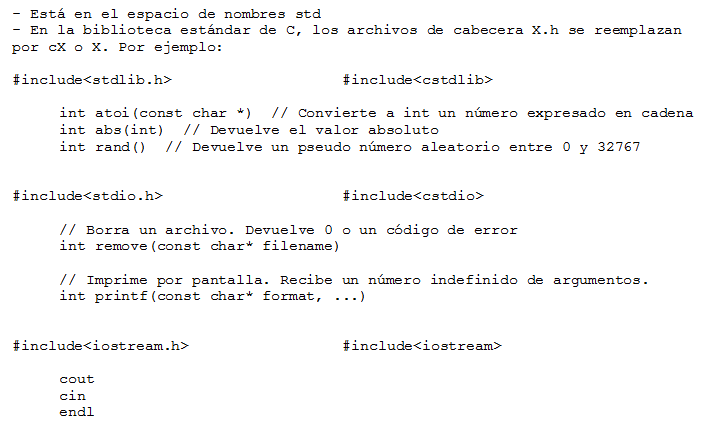

.. -*- coding: utf-8 -*-

.. _rcs_subversion:

Clase 01 - POO 2016
===================

    :Autor: César Osimani
    :Correos: cosimani@ubp.edu.ar - cesarosimani@gmail.com
    :Fecha: 15 de marzo de 2016
    :Regularidad: 
    	- 2 parciales 
	- 1 TPU como tercer parcial
	- Presentación de trabajos en CoNaIISI 2016
		- http://www.ucasal.edu.ar/conaiisi2016/ – Hasta 16 de septiembre
			- Se presentan avances en lugar de cada parcial y TPU
	    	- Pueden proponer otro congreso
    :Temas principales: 
		- Espacio de nombres
		- inline y const
		- std, vector, string
		- Aritmética de punteros
		- Funciones genéricas
		- Herencia y herencia múltiple
		- Polimorfismo
		- Funciones virtuales
		- Clases abstractas
		- Modificador friend
		- Biblioteca Qt
			- Uso de documentación
			- slots y signals
			- QtNetwork
			- Interfaz gráfica de usuario (widgets, layouts, etc.)
			- QPainter y captura de eventos del teclado y del mouse
			- QTimer
			- QtDesigner
		- OpenGL (glOrtho, gluPerspective, glLookAt, rotación, traslación, texturas, ...)
		- Base de datos (SELECT e INSERT).
		- Resolver los problemas consultando documentación técnica de distintas fuentes

Biblioteca estándar de C++
==========================

Espacio de nombres (namespace)
==============================

- Permite agrupar declaraciones (de clases, funciones, etc.).
- Permite declarar identificadores (nombre de variables) sin que se solapen. Es decir, identificadores iguales en distinto namespace.
- Se pueden incluir las definiciones en un namespace pero mejor no.
- Un espacio de nombre es un ámbito.

Ejemplos con namespace
======================

**Ejemplo 1**

.. code-block:: c

	#include <iostream>
	using namespace std;

	namespace enteros  {
	    int var1 = 5;
	    int var2 = 7;
	}

	namespace con_decimales  {
	    float var1 = 5.14;
	    float var2 = 7.13;
	}

	int main()  {
	    cout << enteros::var1 << endl;
	    cout << con_decimales::var1 << endl;
	    return 0;
	}

- ¿Cuál es la salida por consola?

.. ..

 <!---  
 Publica:    5    5.14		(para ocultar requiere una primer linea con .. ..    Los que queremos ocultar debe tener el menos un espacio)
 --->

**Ejemplo 2**

.. code-block:: c

	#include <iostream>
	using namespace std;
	
	namespace enteros  {
	    int var1 = 5;
	    int var2 = 7;
	}
	
	namespace con_decimales  {
	    float var1 = 5.14;
	    float var2 = 7.13;
	}
	
	int main()  {
	    using enteros::var1;
	    using con_decimal::var2;

	    cout << var1 << endl;
	    cout << var2 << endl;
	    cout << enteros::var2 << endl;
	    cout << con_decimales::var1 << endl;

	    return 0;
	}

.. ..

 <!---  
 Publica:    5		7.13		7		5.14
 --->

**Ejemplo 3**

.. code-block:: c

	#include <iostream>
	using namespace std;

	namespace enteros  {
	    int var1 = 5;
	    int var2 = 7;
	}
	
	namespace con_decimales  {
	    float var1 = 5.14;
	    float var2 = 7.13;
	}

	int main()  {
	    using namespace enteros;

	    cout << var1 << endl;
	    cout << var2 << endl;
	    cout << con_decimales::var1 << endl;
	    cout << con_decimales::var2 << endl;

	    return 0;
	}

.. ..

 <!---  
 Publica:    5		7		5.14		7.13
 --->

**Ejemplo 4**

.. code-block:: c

	#include <iostream>
	using namespace std;

	namespace enteros  {
	    int var1 = 5;
	    int var2 = 7;
	}
	
	namespace con_decimales  {
	    float var1 = 5.14;
	    float var2 = 7.13;
	}
	
	int main()  {
	    {
	    using namespace enteros;
	    cout << var1 << endl;
	    }

	    {
	    using namespace con_decimales;
	    cout << var1 << endl;
	    }

	    return 0;
	}

.. ..

 <!---  
 Publica:    5		5.14
 --->

 
Función Genérica
================

- Supongamos que debemos implementar una función que imprima en la salida los valores de un array de enteros:

.. code-block:: c

	void imprimir (int v[], int cantidad)  {
	    for (int i=0 ; i < cantidad ; i++)
	        cout << v[i] << " ";
	}

	int main()  {
	    int v1[5] = {5, 2, 4, 1, 6};
	    imprimir(v1, 3);
	}

- Ahora necesitamos la impresión de un array de float

.. code-block:: c

	void imprimir(float v[], int cantidad);

- Vemos que las versiones se diferencian por el tipo de datos del array. Entonces podemos utilizar lo siguiente:

.. code-block:: c

	template <class T> void imprimir (T v[], int cantidad)  {
	    for (int i=0 ; i < cantidad ; i++)
	        cout << v[i] << " ";
	}

	int main()  {
	    int v1[5] = {5, 2, 4, 1, 6};
	    float v2[4] = {2.3, 5.1, 0, 2};

	    imprimir(v1, 5);  // qué pasa pongo cantidad 10 -> Publica basura 
	    imprimir(v2, 2);
	}

- El compilador utiliza el código de la función genérica como plantilla para crear automáticamente dos funciones sustituyendo T por el tipo de dato concreto.

.. code-block:: c

	Con T = int     >    void imprimir(int v[], int cantidad)

	Con T = float   >    void imprimir(float v[], int cantidad)

- Aquí, la única operación que realizamos sobre los valores de tipo T es:

.. code-block:: c

	cout << v[i]

- Esto pone una restricción, ya que sólo se admitirá los tipos de datos para los que se puedan imprimir en pantalla con:

.. code-block:: c

	cout <<

**Ejercicio 1**

- Escribir en C++ una función genérica para ordenar e imprimir un array (sólo tipos int, float y char). Que la publicación sea ordenada utilizando el método de ordenamiento por inserción.
