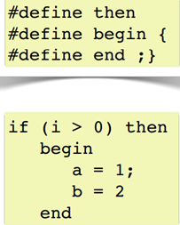

.. -*- coding: utf-8 -*-

.. _rcs_subversion:

Clase 07 - POO 2016
===================

**Dato de color**

**CamelCase**: Es escribir con la forma de jorobas de camello con las mayúsculas y minúsculas. 

- UpperCamelCase: La primera letra de cada palabra es mayúscula. Ejemplo: EjemploDeUpperCamelCase.
- lowerCamelCase: Igual a UpperCamelCase con excepción de la primer palabra. Ejemplo: ejemploDeLowerCamelCase

El preprocesador
^^^^^^^^^^^^^^^^

-	Analiza el archivo fuente antes de la compilación real
-	Realiza las sustituciones de macros
-	Una macro es un patrón de sustitución formado por expresiones textuales
-	Procesa las directivas (''#include'', #define, #ifndef, ...)
-	Elimina los comentarios.

**Directivas #ifdef #endif #ifndef**

- Con #ifdef si la macro está definida, entonces hace lo siguiente hasta encontrar un #endif
- #ifndef pregunta si no está definida

**Directiva #include**

- Inserta archivos
- Influye sobre el ámbito y los identificadores

.. code-block:: c

	#include <nombre de fichero cabecera>
	#include "nombre de fichero de cabecera"

**Directiva #define**

- Define macros para sustituir cada vez que se encuentre el identificador.

.. code-block:: c

	#define identificador <secuencia>
	
-	Si 'secuencia' no existe, el identificador será eliminado cada vez que aparezca
-	No es necesario añadir un punto y coma al final
-	Termina en el primer retorno de línea encontrado
-	Podríamos definir un nuevo lenguaje
 

**Ejercicio 1:**

- Nuevo proyecto Empty 
- Crear un .h vacío y definir una clase Persona con int edad y string nombre.
- En el archivo main.cpp incluir dos veces el archivo .h
- Tratar de resolver el problema sólo modificando el .h

.. ..

 <!---  
 - El problema se soluciona con el uso del Guardián de inclusión múltiple:

 #ifndef PRINCIPAL_H
 #define PRINCIPAL_H

 // . . . 

 #endif // PRINCIPAL_H
 --->

Web Service
^^^^^^^^^^^

- Para intercambiar datos entre aplicaciones
- Generalmente a través del protocolo HTTP
- La info puede viajar en XML, JSON, etc.
- Fomenta y facilita el uso y desarrollo de APIs Web
- https://es.wikipedia.org/wiki/Servicio_web

**Algunas APIs disponibles**

- Twitter - https://dev.twitter.com
- Facebook - https://developers.facebook.com
- Amazon - https://developer.amazonservices.es
- Spotify - https://developer.spotify.com/web-api
- MercadoLibre - http://developers.mercadolibre.com
- Google - https://developers.google.com
	- Youtube
	- Traductor
	- Google+
	- Maps
	- Street View
	- MercadoLibre

**Google Maps**

- URL para su uso: https://developers.google.com/maps/documentation/staticmaps
- Ejemplo: http://maps.googleapis.com/maps/api/staticmap?center=rondeau+100+cordoba&zoom=15&size=500x300&maptype=roadmap&sensor=false
- Descripción de los parámetros en: https://developers.google.com/maps/documentation/staticmaps/#URL_Parameters
- Pueden habilitar otros servicios en https://code.google.com/apis/console

**QUrl**

- Para manipular una url ingresada por el usuario 

.. code-block:: c
	
	// URL ejemplo: http://www.yahoo.com.ar/documento/info.html
		
	// El método path() devuelve /documento/info.html
	// El método host() devuelve www.yahoo.com.ar
	
	QUrl url("http://www.yahoo.com.ar/documento/info.html");
	qDebug() << url.host();
	qDebug() << url.path();
	
Dibujar a mano sobre un QWidget
^^^^^^^^^^^^^^^^^^^^^^^^^^^^^^^

.. code-block:: c

	// mapa.h
	#include <QWidget>

	class Mapa : public QWidget  {
	    Q_OBJECT

	public:
	    Mapa()  {  }

	protected:
	    void paintEvent(QPaintEvent *);

	};

	// mapa.cpp
	#include "mapa.h"
	#include <QPainter>

	void Mapa::paintEvent(QPaintEvent *)  {
	    QPainter painter(this);
	    painter.drawLine(0, 0, this->width(), this->height());
	}

**Clase QPainter**

- Pinta a bajo nivel sobre widgets.
- Debe ser utilizado dentro del método paintEvent(QPaintEvent*).

.. code-block:: c

	void drawEllipse(int x, int y, int ancho, int alto)
	void drawImage(int x, int y, QImage & image)
	void drawLine(int x1, int y1, int x2, int y2)
	void drawText(int x, int y, QString & text)
	void fillRect(int x, int y, int ancho, int alto)
	
**Ejercicio:** Comenzar un proyecto vacío con QtCreator y diseñar un login de usuarios:
 
.. figure:: images/clase07/login.png 

- Tendrá un tamaño de 250x120 píxeles y llevará por título "Login".
- El único usuario válido es: (DNI del alumno):(últimos 3 números del DNI)
- Ocultar con asteriscos la clave.
- Si el usuario y clave no es válido, sólo el campo de la clave se deberá limpiar.
- Al fallar la clave 3 veces, la aplicación se cierra. 
- Si el usuario es válido, entonces se oculta el login y se visualiza un nuevo QWidget como el que sigue:

.. figure:: images/clase07/ventana.png

- Utilizar una imagen del disco aproximadamente de 100x100 píxeles.
- Esta imagen se mostrará en el QWidget exactamente centrada.
- Dibujar además un cuadrado que envuelva la imagen (como muestra el ejemplo).
- La ventana puede tener cualquier tamaño pero llevará por título "Ventana".

