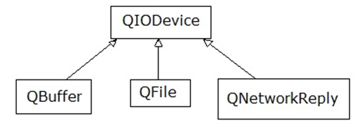

.. -*- coding: utf-8 -*-

.. _rcs_subversion:

Clase 08 - POO 2016
===================

Clase QNetworkAccessManager
^^^^^^^^^^^^^^^^^^^^^^^^^^^

- Permite enviar y recibir solicitudes a la red
- Se obtiene un objeto ``QNetworkReply`` con toda la información recibida

.. code-block:: c

	QNetworkAccessManager* manager = new QNetworkAccessManager;

	connect(manager, SIGNAL(finished(QNetworkReply*)), this, SLOT(slot_respuesta(QNetworkReply*)));

	manager->get(QNetworkRequest(QUrl("http://mi.ubp.edu.ar")));

- Para poder utilizar las clases de network hay que agregar en el .pro

.. code-block:: c

	QT += network  // Esto agrega al proyecto el módulo network

- Por defecto, el módulo 'gui' y el módulo 'core' están incluidos.
- Para utilizar HTTPS, Qt utiliza OpenSSL https://www.openssl.org/source

Clase QIODevice
^^^^^^^^^^^^^^^

- Clase base de los dispositivos de I/O
- Algunos métodos:

.. code-block:: c

	QByteArray readAll()  		 // Lee todos los datos disponibles.
	QByteArray read(qint64 max)  // Lee hasta max datos disponibles.
	QByteArray readLine()  		 // Lee una linea.

Clase QNetworkReply
^^^^^^^^^^^^^^^^^^^

- Contiene los datos y encabezado de una respuesta
- Una vez leídos los datos, ya no quedarán disponibles.
- Para controlar los bytes que se van descargando usar la señal:

.. code-block:: c

	void downloadProgress(qint64 bytesRecibidos, qint64 bytesTotal)

Clase QNetworkRequest
^^^^^^^^^^^^^^^^^^^^^

- Contiene la información que se envían en la petición
- Seteamos algún campo de la cabecera con:

.. code-block:: c

	void setRawHeader(const QByteArray &nombre, const QByteArray & valor)

	QNetworkRequest request;
	request.setUrl(QUrl(ui->le->text()));
	request.setRawHeader("User-Agent", "MiNavegador 1.0");

Clase QNetworkProxyFactory
^^^^^^^^^^^^^^^^^^^^^^^^^^

- Permite configurar un servidor proxy a nuestra aplicación Qt.
- Lo siguiente utiliza la configuración del sistema (Chrome y IE, no Firefox).

.. code-block:: c

	#include <QApplication>
	#include "principal.h"
	#include <QNetworkProxyFactory>

	int main(int argc, char *argv[])  {
	    QApplication a(argc, argv);

	    QNetworkProxyFactory::setUseSystemConfiguration(true);

	    Principal w;
	    w.showMaximized();

	    return a.exec();
	}

Obtener una imagen desde internet
^^^^^^^^^^^^^^^^^^^^^^^^^^^^^^^^^

.. code-block:: c

	void Principal::slot_descargaFinalizada(QNetworkReply *reply)  {
	    QImage image = QImage::fromData(reply->readAll());
	}

**Ejercicio:** Hacer una aplicación para buscar una dirección en Google Maps

- Definir la clase Mapa. Será el QWidget donde se dibujará el mapa de google.
- Definir la clase Ventana para contener al layout.
- Ese layout tendrá:
	- QLineEdit para ingresar un domicilio
	- QPushButton para buscar ese domicilio
	- Mapa
	- QSlider vertical para aumentar y disminuir el zoom

