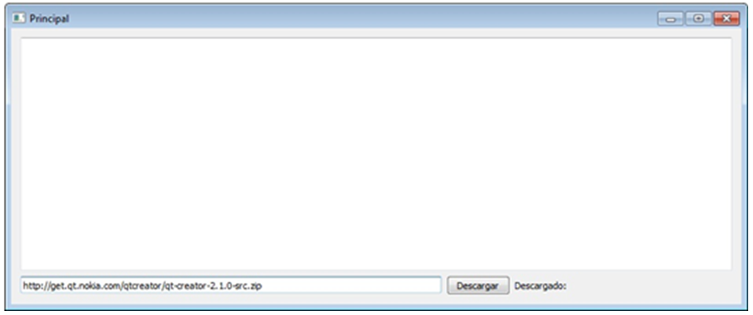

.. -*- coding: utf-8 -*-

.. _rcs_subversion:

Clase 09 - POO 2016
===================

Clase QWebView
^^^^^^^^^^^^^^

- Es un QWidget que tiene todas las características de un navegador
- Dispone del método load() para cargar un sitio web
- Requiere la inclusión del siguiente módulo 

.. code-block:: c

	QT += webkitwidgets

**Ejercicio:** Diseñar la siguiente interfaz de usuario:

 
- Mostrar el código fuente del sitio en el QTextEdit
- También incluir un QLabel para indicar el porcentaje de descarga

**Ejercicio:** Navegador - Diseñar la siguiente interfaz de usuario:

- Utilizar sólo 2 widgets: un QLineEdit y un QWebView (ningún QPushButton)
- Por defecto se cargará la página de Google
- Filtrar el acceso a los dominios terminados en: edu.ar y gov.ar
- Cuando un sitio se haya filtrado mostrar el mensaje "Sitio bloqueado"

Clases derivadas
^^^^^^^^^^^^^^^^

.. code-block:: c
 
	// personal.h
	#include <QString>

	class Personal  {
	public:
	    QString verEdad()  {  return "Edad: " + QString::number(edad);  }
	    QString verSalario()  {  return "Salario: " + QString::number(salario);  }

	protected:  // Para acceso desde las clases derivadas
	    int edad;
	    int salario;
	};

	// Modificadores de acceso para Herencia:
	//    public  ->  Mantiene los modificadores de acceso de la clase base
	//    private ->  Pasa todo a privado
	class Desarrollador : public Personal  {
	public:
	    Desarrollador(int edad)  {
	    salario = 2000;
	    this->edad = edad;
	}

	// Se podrá usar? 
	Desarrollador(int edad) : salario(2000), edad(edad)  {  }
	    // No. Sólo para miembros de la propia clase (no para heredados).
	};

	class Administrador : public Personal  {
	public:
	    Administrador()  {
	    salario = 2000;
	    edad = 30;
	}
	};

	#include <QApplication>
	#include "personal.h"
	#include <QDebug>

	int main(int argc, char** argv)  {
	    QApplication a(argc, argv);

	    Desarrollador juan(20);
	    Administrador marcos;

	    qDebug() << juan.verEdad();
	    qDebug() << juan.verSalario();

	    qDebug() << marcos.verEdad();
	    qDebug() << marcos.verSalario();

	    return a.exec();
	}

Constructor de la clase derivada
^^^^^^^^^^^^^^^^^^^^^^^^^^^^^^^^

.. code-block:: c

	class Persona  {
	public:
	    Persona(int edad) : edad(edad)  {  }
	    QString verEdad()  {  return "Edad: " + QString::number(edad);  }
	    void setEdad(int edad)  {  this->edad = edad;  }

	protected:
	    int edad;
	};

	class Empleado : public Persona  {
	public:
	    // Siempre primero se llama al constructor de la clase base
	    Empleado(int edad, int salario) : Persona(edad), salario(salario)  {  }
	    QString verSalario()  {  return "Salario: " + QString::number(salario);  }

	protected:
	    int salario;
	};

	#include <QApplication>
	#include "personal.h"
	#include <QDebug>

	int main(int argc, char** argv)  {
	    QApplication a(argc, argv);

	    Persona carlos(24);
	    Empleado ale(20, 2500);

	    qDebug() << carlos.verEdad();
	    //    qDebug() << carlos.verSalario();  // No compila. No está en la clase base.

	    qDebug() << ale.verEdad();
	    qDebug() << ale.verSalario();

	    return a.exec();
	}

Destructor de la clase derivada
^^^^^^^^^^^^^^^^^^^^^^^^^^^^^^^

.. code-block:: c

	class ClaseA  {
	public:
	    ClaseA() : datoA(10)  {  qDebug() << "Constructor A";  }
	    ~ClaseA()  {  qDebug() << "Destructor A";  }
	    int verA()  {  return datoA;  }

	protected:
	    int datoA;
	};

	class ClaseB : public ClaseA  {
	public:
	    ClaseB() : datoB(20)  {  qDebug() << "Constructor B";  }
	    ~ClaseB()  {  qDebug() << "Destructor B";  }
	    int verB()  {  return datoB;  }

	protected:
	    int datoB;
	};

	#include <QApplication>
	#include "personal.h"
	#include <QDebug>

	int main(int argc, char** argv)  {
	    QApplication a(argc, argv);

	    {
	    ClaseB objeto;
	    qDebug() << "a=" << objeto.verA() << ", b=" << objeto.verB();
	    }

	    return a.exec();
	}

	// Publica
	Constructor A
	Constructor B
	a=10, b=20
	Destructor B
	Destructor A

