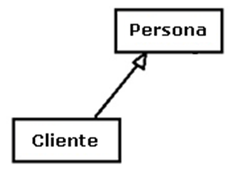
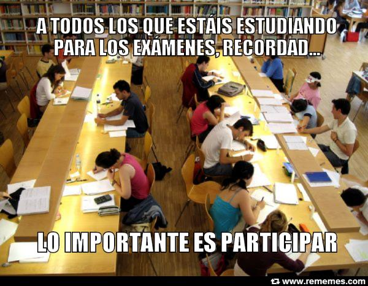

.. -*- coding: utf-8 -*-

.. _rcs_subversion:

Clase 10 - POO 2016
===================

Polimorfismo
^^^^^^^^^^^^

- Lo utilizamos con punteros.
- Nos permite acceder a objetos de la clase derivada usando un puntero a la clase base.
- Sin embargo, sólo podemos acceder a datos y funciones que existan en la clase base.
- Los datos y funciones propias de la derivada quedan inaccesibles.

.. code-block:: c

	class Persona  {
	public:
	    Persona(QString nombre) : nombre(nombre)  {  }
	    QString verNombre()  {  return "Nombre: " + nombre;  }

	protected:  // Para acceso desde las clases derivadas
	    QString nombre;
	};

	class Empleado : public Persona  {
	public:
	    Empleado(QString nombre) : Persona(nombre)  {  }
	    QString verNombre()  {  return "Empleado: " + nombre;  }
	    void mostrarAlgo()  {  qDebug() << "Algo";  }
	};

	class Estudiante : public Persona  {
	public:
	    Estudiante(QString nombre) : Persona(nombre)  {  }
	    QString verNombre()  {  return "Estudiante: " + nombre;  }
	};

	#include <QApplication>
	#include "personal.h"
	#include <QDebug>

	int main(int argc, char** argv)  {
	    QApplication a(argc, argv);

	    {
	    Persona *jose = new Estudiante("Jose");
	    Persona *carlos = new Empleado("Carlos");

	    qDebug() << carlos->verNombre();
	    qDebug() << jose->verNombre();
	    carlos->mostrarAlgo();  // Esta línea compila? 

	    delete jose;
	    delete carlos;
	    }

	    return a.exec();
	}
	
**Para todo hay un mexicano que también lo explica** 

- Clic sobre el GIF para abrir video 

|ImageLink|_

.. |ImageLink| image:: /images/clase10/explicacion_mexicana.gif
.. _ImageLink: https://www.youtube.com/watch?v=6lIGfzZ4oqo
	
Funciones virtuales
^^^^^^^^^^^^^^^^^^^

- Puede ser interesante llamar a la función de la derivada (en polimorfismo).
- Al declarar una función como virtual en la clase base, si se superpone en la derivada, al invocar usando el puntero a la clase base, se ejecuta la versión de la derivada.

.. code-block:: c

	class Persona  {
	public:
	    Persona(QString nombre) : nombre(nombre)  {  }
	    virtual QString verNombre()  {  return "Persona: " + nombre;  }

	protected:  
	    QString nombre;
	};

	class Empleado : public Persona  {
	public:
	    Empleado(QString nombre) : Persona(nombre)  {  }
	    QString verNombre()  {  return "Empleado: " + nombre;  }
	};

	#include <QApplication>
	#include "personal.h"
	#include <QDebug>

	int main(int argc, char** argv)  {
	    QApplication a(argc, argv);

	    {
	    Persona *carlos = new Empleado("Carlos");

	    qDebug() << carlos->verNombre();

	    delete carlos;
	    }

	    return a.exec();
	}

Ejercitación para primer parcial
^^^^^^^^^^^^^^^^^^^^^^^^^^^^^^^^

**Ejercicio:** Definir la siguiente jerarquía de clases:
 

- Se pedirá definición de atributos y métodos (en papel y sin utilizar material de consulta)
- Instanciar objetos de estas clases.
- Prestar atención sobre los punteros a objetos, ámbitos, parámetros en funciones, modificadores de acceso, ...

**Ejercicio:** Aritmética de punteros.

.. code-block:: c

	#include <QApplication>
	#include <QDebug>

	int main(int argc, char** argv)  {
	    QApplication app(argc, argv);

	    int a = 10, b = 10, c = 10, d = 10, e = 10;
	    int m[10] = {1, 2, 3, 4, 5, 6, 7, 8, 9, 10};
	    int *p = &m[2], *q = &m[4];

	    qDebug() << a + m[d/c] + b-- / *q + 10 + e--;
	    p = m;
	    qDebug() << e + *p + m[4]++;

	    return 0;
	}
	
- Escribir la salida por consola.

**Ejercicio:** Comenzar un proyecto vacío con QtCreator y diseñar el siguiente login de usuarios:
 
.. figure:: images/clase10/login.png  

- Este login tendrá las siguientes características:
	- Cuidar muy bien el layout. Notar la ubicación del botón con respecto a los campos.
	- Definido en la clase Login en los archivos login.h y login.cpp.
	- La ventana tendrá un tamaño de 250x120 píxeles y llevará por título "Login".
	- El único usuario válido es (DNI del alumno):(últimos 4 números del DNI)
	- Ocultar con asteriscos la clave.
	- Si el usuario y clave no es válido, sólo el campo de la clave se deberá limpiar.
	- Al fallar la clave 3 veces, la aplicación se cierra. 

- Si el usuario es válido, entonces se ocultará el login y se visualizará un nuevo QWidget como el que sigue:

.. figure:: images/clase10/ventana.png  
 
- Este widget tendrá las siguientes características:
 	- Definido en la clase Ventana en los archivos ventana.h y ventana.cpp.
	- Con QNetworkAccessManager descargar una imagen cualquiera de 100x100 píxeles.
	- Esta imagen se mostrará en el QWidget centrada (como muestra el ejemplo).
	- Dibujar además un cuadrado que envuelva la imagen (como muestra el ejemplo).
	- La ventana puede tener cualquier tamaño y llevará por título "Ventana".

Métodos virtuales de QWidget para capturar eventos
^^^^^^^^^^^^^^^^^^^^^^^^^^^^^^^^^^^^^^^^^^^^^^^^^^

- Algunos de ellos:

.. code-block:: c

	virtual void mouseDoubleClickEvent(QMouseEvent* event)
	virtual void mouseMoveEvent(QMouseEvent* event)
	virtual void mousePressEvent(QMouseEvent* event)
	virtual void keyPressEvent(QKeyEvent* event)
	virtual void resizeEvent(QResizeEvent* event)
	virtual void moveEvent(QMoveEvent* event)
	virtual void closeEvent(QCloseEvent* event)

- Estos métodos pueden ser reimplementados en una clase derivada para recibir los eventos.

**Ejercicio:** Al ingresar la URL de una imagen deberá mostrarla como en la figura

 
- Al hacer clic sobre una de estas imágenes, deberá ocultarse la misma. 
- Cuando se oculta la segunda imagen, cerrar la aplicación.

Un par de memes para recordar que se viene el examen
^^^^^^^^^^^^^^^^^^^^^^^^^^^^^^^^^^^^^^^^^^^^^^^^^^^^

.. figure:: images/clase10/meme2.jpg

.. figure:: images/clase10/meme4.jpg

