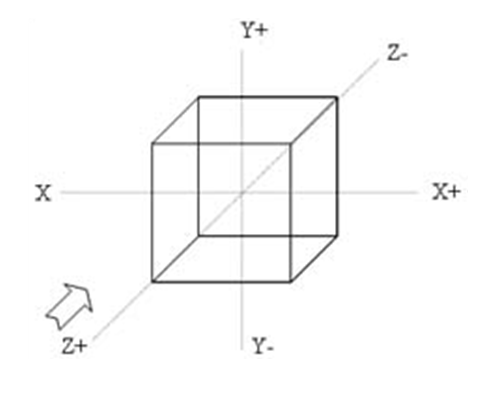

.. -*- coding: utf-8 -*-

.. _rcs_subversion:

Clase 19 - POO 2016
===================

Herencia múltiple
^^^^^^^^^^^^^^^^^

- La clase derivada hereda todos los datos y funciones de todas las clases base
- Puede suceder que en la clases base existan funciones con igual nombre
- Los casos de ambigüedad se solucionan con el nombre completo
- Otra solución sería redefinir en la derivada la función ambigua.

.. code-block:: c	

	#include <QApplication>
	#include <QDebug>

	class ClaseA  {
	public:
	    ClaseA(int a) : valorA(a)  {  }
	    int verValor()  {  return valorA;  }

	protected:
	    int valorA;
	};

.. code-block:: c	

	class ClaseB  {
	public:
	    ClaseB() : valorB(20)  {  }
	    int verValor()  {  return valorB;  }

	protected:
	    int valorB;
	};

.. code-block:: c	

	class ClaseC : public ClaseA, public ClaseB  {
	public:
	    ClaseC(int c) : ClaseA(c), ClaseB()  {  }
	    int verValor()  {  return ClaseA::verValor();  }
	};

.. code-block:: c	

	int main(int argc, char** argv)  {
	    QApplication a(argc, argv);

	    ClaseC c(10);
	    qDebug() << c.verValor();  
	    qDebug() << c.ClaseB::verValor();  

	    return 0;
	}

**Ejercicio:** Definir dos QWidgets (una clase Login y una clase Ventana).

- El Login validará al usuario contra la base Access
- La ventana Ventana sólo mostrará un QPushButton para "Volver" al login.
- Crear solamente un objeto de Ventana y uno solo de Login.

**Ejercicio:** Crear una clase base llamada Instrumento y las clases derivadas Guitarra, Bateria y Teclado.  

- La clase base tiene una función virtual pura llamada ``sonar()``. 
- Defina una función virtual ``verlo()`` que publique la marca del instrumento. Por defecto todos los instrumentos son de la marca Yamaha. 
- Utilice en la función ``main()`` un ``std::vector`` para almacenar punteros a objetos del tipo Instrumento. Instancie 5 objetos y agréguelos al ``std::vector``.
- Publique la marca de cada instrumento recorriendo el vector.
- En las clases derivadas agregue los datos miembro "``int cuerdas``", "``int teclas``" e "``int tambores``" según corresponda. Por defecto, guitarra con 6 cuerdas, teclado con 61 teclas y batería con 5 tambores.
- Haga que la clase ``Teclado`` tenga herencia múltiple, heredando además de una nueva clase ``Electrico``. Todos los equipos del tipo "``Electrico``" tienen por defecto un voltaje de 220 volts. Esta clase deberá tener un destructor que al destruirse publique la leyenda "Desenchufado".
- Al llamar a la función ``sonar()``, se deberá publicar "Guitarra suena...", "Teclado suena..." o "Batería suena..." según corresponda.
- Incluya los métodos ``get`` y ``set`` que crea convenientes.

Graficación 3D
==============

OpenGL
^^^^^^

- Open Graphics Library
- Especificación que define una API para dibujar en 2D y 3D.
- Los fabricantes de Hardware se basan en esta especificación.
- Funciones para dibujar escenas complejas desde primitivas geométricas.
- Primitivas geométricas simples: Puntos, líneas y triángulos.
- Desarrollada por Silicon Graphics Inc. (1992).
- En 2006 pasa al Grupo Khronos
- Compite con Direct3D de Microsoft

**Para tener en cuenta**
- Las funciones de OpenGL comienzan con ``gl`` y las constantes con ``GL_``
- Existe un sufijo que indica la cantidad de parámetros y el tipo

.. code-block:: c	

	glVertex3f  // 3 parámetros del tipo float

- OpenGL define sus tipos de datos (con ``typedef``)

.. code-block:: c	

	// (typedef se utiliza para asignar un alias a un tipo)

	typedef int GLint
	typedef float GLfloat	

	// s Entero 16-bits short            GLshort
	// i Entero 32-bits int              GLint
	// f Punto flotante 32-bits float    GLfloat
	// d Punto flotante 64-bits double   GLdouble

**Algunos datos**

- Cuando el ojo percibe 24 cuadros por segundo, lo ve real.
- Mayor cantidad de imágenes se verá mejor aún.
- Luego de 60 cuadros por segundo no se notan mejoras.
- Hay bibliotecas que aportan más funcionalidades: GLU, GLUT, GLEW, etc.
- Las primitivas se componen de vértices (puntos en 3D).
- Perspectiva ortonormal: 
 

- Punto en 3D. 

.. code-block:: c	

	glVertex3f(10.0f, 5.0f, 3.0f);

.. figure:: images/clase19/punto.png

Dibujando primitivas
^^^^^^^^^^^^^^^^^^^^

**Puntos GL_POINTS**

.. code-block:: c

	glBegin(GL_POINTS);
	    glVertex3f(0.0f, 0.0f, 0.0f);
	    glVertex3f(10.0f, 10.0f, 10.0f);
	glEnd();

- Comienza indicando el tipo de primitiva con ``glBegin()``.
- ``glBegin()`` y ``glEnd()`` actúan como llaves, por ello se acomoda de esa forma.
- Un punto por defecto tiene 1 píxel por 1 píxel
- Podemos setear su tamaño:

.. code-block:: c

	glPointSize(6.0f); // tamaño del pixel = 6

**Líneas GL_LINES**

.. code-block:: c

	GLfloat angulo;
	int i;

	glBegin(GL_LINES);
	for (i=0; i<360; i+=3)  {
	    angulo = (GLfloat)i*3.14159f/180.0f; // grados a radianes
	    glVertex3f(0.0f, 0.0f, 0.0f);
	    glVertex3f(cos(angulo), sin(angulo), 0.0f);
	}
	glEnd();

- Dos puntos hacen una recta.
- Con un número impar de puntos, el último se ignora.

**Líneas consecutivas GL_LINE_STRIP**

- El primer punto y el segundo forman una línea.
- El tercer punto forma una línea con el segundo y así sucesivamente.

**Triángulos GL_TRIANGLES**

.. code-block:: c

	glBegin(GL_TRIANGLES);
	    glVertex3f(0, -1.0f, -0.5f);
	    glVertex3f(1.0f, -0.9f, -0.5f);
	    glVertex3f(0.0f, -0.5f, -0.5f);
	glEnd();

**Color de relleno**

- Modificamos el color con ``glColor3f()`` con valores de 0 a 1.

.. code-block:: c

	glBegin(GL_TRIANGLES);
	    glColor3f(0, 0, 1);
	    glVertex3f(0, -1.0f, -0.5f);
	    glVertex3f(1.0f, -0.9f, -0.5f);
	    glVertex3f(0.0f, -0.5f, -0.5f);
	glEnd();

Uso de la Clase QGLWidget
^^^^^^^^^^^^^^^^^^^^^^^^^

.. code-block:: c

	#include <QGLWidget>

	class MiOpenGL : public QGLWidget  {
	public:
	    MiOpenGL();

	protected:
	    void initializeGL();	
	    void resizeGL(int w, int h);
	    void paintGL();
	};

	void MiOpenGL::initializeGL()  { 
	    glClearColor(0,0,0,0);
	}

	void MiOpenGL::resizeGL(int w, int h)  {
	    // Porción de ventana donde puede dibujar.
	    glViewport(0, 0, w, h);

	    // Especifica la matriz actual: matriz de proyección (GL_PROJECTION), matriz de modelo
	    // (GL_MODELVIEW) y matriz de textura (GL_TEXTURE). 
	    glMatrixMode(GL_PROJECTION);

	    // Con esto cargamos en el "tipo" de matriz actual (matriz identidad - como resetear).
	    // Es una matriz 4x4 llena de ceros salvo la diagonal que contiene unos. 
	    glLoadIdentity();

	    // Para delimitar la zona de trabajo en una caja.
	    glOrtho(-1, 1, -1, 1, -1, 1);

	    // Se vuelve a este tipo de matrices, que afecta a las primitivas geométricas.
	    glMatrixMode(GL_MODELVIEW);
	}

	void MiOpenGL::paintGL()  {
	    // Borra un buffer.
	    glClear(GL_COLOR_BUFFER_BIT);

	    //  Carga la matriz identidad.
	    glLoadIdentity();

	    // Acá se inserta el código para dibujar 

	    // Volcamos en pantalla lo que se creó en memoria.
	    glFlush();
	}

**Ejercicio:**

- Dibujar un cajón deforme sin tapa con un color distinto en cada lado.
- Utilizar el teclado para hacerlo rotar sobre los tres ejes.

