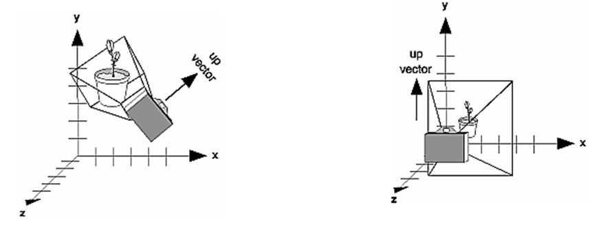

.. -*- coding: utf-8 -*-

.. _rcs_subversion:

Clase 22 - POO 2016
===================

**Posicionando la cámara**

- La siguiente función realiza el efecto del posicionamiento de la cámara.

.. code-block:: c

	void gluLookAt(GLdouble ojoX, GLdouble ojoY, GLdouble ojoZ, 
	               GLdouble haciaX, GLdouble haciaY, GLdouble haciaZ, 
	               GLdouble upX, GLdouble upY, GLdouble upZ)
				   

**Ejercicio:**

- Marcar 4 puntos en la escena donde se haga clic con el mouse.
- Ni bien se marque el 4to, automáticamente se generará el polígono de 4 vértices.
- Con la tecla C se puede cambiar entre distintos colores de relleno.
- Con A y D se rota sobre el eje Y.
- Con W y S se rota sobre el eje X.

**Ejercicio:**

- Dibujar un cuadrado cualquiera en el plano z=-2.
- Controlar la posición de la cámara con las teclas.
- La cámara siempre vertical y mirando al punto (0, 0, -100).

**Ejercicio:**

- Dibujar una ruta con la línea blanca interrumpida.
- Con las teclas Up y Down acelerar y frenar
		   
MiniExámenes
============

- Sin clases: 10 de junio (Expotrónica) - 17 de junio (IEEE UTN Bs. As.)
- Última semana (21 y 24 de junio) para recuperatorios y coloquios
- Se promediarán para la tercer nota de POO
- Previstos: Jun 7 - Jun 14
- Tiempo: 30 minutos
- Temas para el 7 de junio: 
	- Herencia - Herencia múltiple - Polimorfismo 
	- Funciones virtuales y funciones virtuales puras
	- QTimer
	- Dibujar con QPainter
	- GUI con QtDesigner

Temas para 2do parcial
======================

- GUI y promoción con QtDesigner
- Señales propias
- Escenas con OpenGL
- glOtho y gluPerspective
- Rotación, traslación y escalado
- Colores planos y en degradé
- Eventos del mouse y del teclado
- QTimer para actualizar la escena

	

